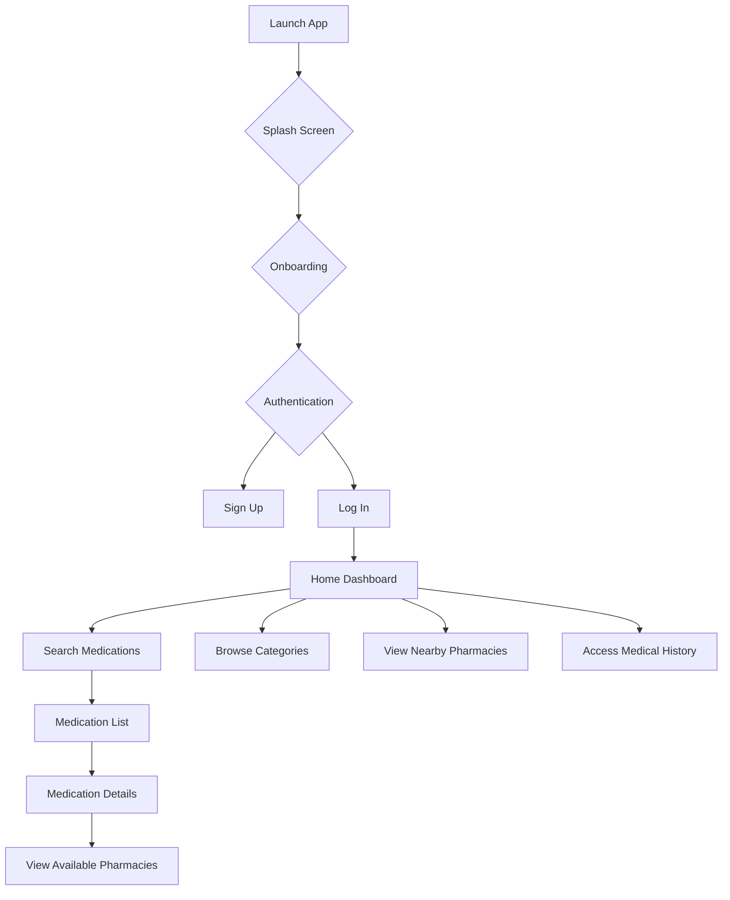
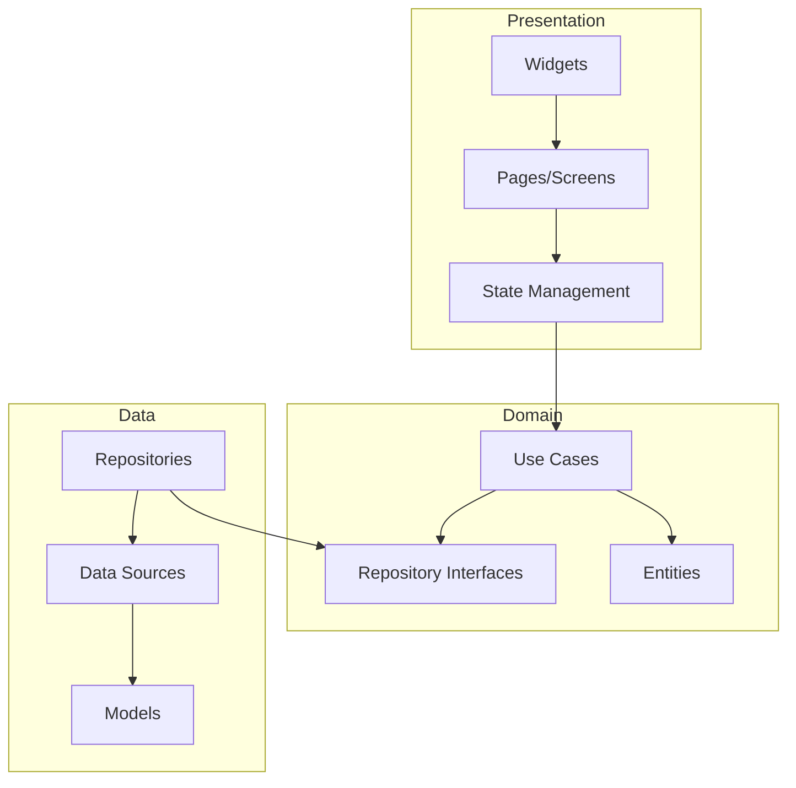

# MedConnect Design Document

## 1. Overview

MedConnect is a comprehensive mobile application for both patients and pharmacists. It aims to bridge the communication gap between them, providing a platform for seamless interaction.

For patients, MedConnect offers a secure way to manage their medical records, communicate with pharmacists, order medications, and browse nearby pharmacies.

For pharmacists, MedConnect provides a suite of tools to manage their pharmacy, including sales, inventory, and patient communication.

This document outlines the design and architecture of the MedConnect application, built using Flutter.

## 2. Detailed Analysis of the Goal or Problem

The healthcare industry, particularly the pharmacy sector, often faces challenges in communication and information management. Patients struggle to keep track of their medical records, find information about medications, and communicate effectively with their pharmacists. Pharmacists, on the other hand, need efficient tools to manage their inventory, sales, and patient interactions.

MedConnect aims to solve these problems by providing a unified platform that addresses the needs of both patients and pharmacists.

### For Patients:

*   **Problem**: Fragmented medical records, difficulty in accessing personal health information.
*   **Solution**: A secure, centralized platform to store and manage medical history, including conditions, prescriptions, and allergies.

*   **Problem**: Lack of information about medications, their availability, and pricing.
*   **Solution**: A searchable database of medications with detailed information, including prices, availability in nearby pharmacies, and user reviews.

*   **Problem**: Inefficient communication with pharmacists.
*   **Solution**: A built-in messaging feature to communicate directly with pharmacists for inquiries and consultations.

### For Pharmacists:

*   **Problem**: Manual and time-consuming inventory and sales management.
*   **Solution**: A digital inventory management system to track medications, quantities, expiry dates, and prices.

*   **Problem**: Limited channels for patient engagement and support.
*   **Solution**: A platform to communicate with patients, answer their queries, and provide better customer service.

*   **Problem**: Difficulty in reaching a wider patient base.
*   **Solution**: A platform to list their pharmacy, making it discoverable to nearby patients.

## 3. Alternatives Considered

### 3.1. State Management

*   **BLoC (Business Logic Component)**: A popular and powerful state management library that separates business logic from the UI. While very robust, it can introduce boilerplate code and a steeper learning curve.
*   **Riverpod**: A modern and flexible state management library that offers compile-safe state management. It is a great option but might be overly complex for some parts of the application.
*   **Provider**: A simple and intuitive state management solution that is easy to learn and use. It is a good choice for simpler applications but might not be as scalable for a complex app like MedConnect.
*   **Chosen Approach**: We will use a combination of `ChangeNotifier`, `ValueNotifier`, and `FutureBuilder`/`StreamBuilder`. This approach provides a good balance of simplicity and power. For simple, local state, `ValueNotifier` is sufficient. For more complex state, `ChangeNotifier` can be used. For handling asynchronous operations, `FutureBuilder` and `StreamBuilder` are ideal. This approach allows us to start with a simple solution and scale up to a more robust one like Riverpod or BLoC if needed in the future.

### 3.2. Architecture

*   **Simple Feature-based Architecture**: Organizing the code by features is a good practice, but without a clear separation of concerns, it can lead to a monolithic and hard-to-maintain codebase.
*   **Clean Architecture**: A more robust architectural pattern that separates the code into layers: Presentation, Domain, and Data. This approach promotes separation of concerns, testability, and maintainability.
*   **Chosen Approach**: We will adopt a **Clean Architecture** with a feature-based project structure. This will provide a solid foundation for building a scalable and maintainable application. The code will be organized by features, and within each feature, the Clean Architecture layers will be applied.

## 4. Detailed Design

### 4.1. Architecture

The application will follow a Clean Architecture with a feature-based project structure. The main directories will be:

*   `lib/core`: For app-wide utilities, constants, network setup, and generic widgets.
*   `lib/common`: For features and components shared between the patient and pharmacist apps (e.g., authentication, shared models).
*   `lib/features`: This will contain the two main parts of the app: `patient_app` and `pharmacist_app`.

Each feature will be divided into three layers:

*   **Data Layer**: Responsible for data retrieval and storage. It will include data sources (API clients, local database), models, and repositories.
*   **Domain Layer**: Contains the core business logic of the application. It will include entities, use cases, and repository interfaces.
*   **Presentation Layer**: Responsible for the UI and state management. It will include pages (screens), widgets, and state management classes (e.g., `ChangeNotifier`s).

### 4.2. Data Model

The application will have the following data models:

*   **Patient**:
    *   `PersonalDetails`: `fullName`, `age`, `gender`, `address`, `email`, `phoneNumber`.
    *   `MedicalHistory`: `conditions`, `medications`, `prescriptions`, `diagnoses`, `allergies`.
*   **Pharmacist**:
    *   `PersonalInformation`: `name`, `email`, `address`, `contactNumber`.
    *   `PharmacyInformation`: `name`, `email`, `address`, `type`, `frontalImage`, `description`.
    *   `Verification`: `license`, `pcnRegistration`.
*   **Inventory**: `medicationName`, `brandName`, `quantity`, `expiryDate`, `price`, `inStock`.
*   **Medication**: `name`, `brand`, `category`, `price`, `manufacturer`, `dosage`, `form`, `availability`.
*   **Pharmacy**: `name`, `location`, `contactInfo`, `operatingHours`, `rating`.

### 4.3. User Interface (UI)

The UI will be designed to be clean, intuitive, and user-friendly. The "Inter" font will be used throughout the application. The app will support both light and dark themes.

**Key Screens:**

*   **Patient App**:
    *   Onboarding and Authentication screens.
    *   Home Dashboard with search, categories, and nearby pharmacies.
    *   Medication Details page.
    *   Pharmacy Details page.
    *   Medical History page.
    *   User Profile and Settings.
*   **Pharmacist App**:
    *   Authentication screens.
    *   Dashboard for managing pharmacy information.
    *   Inventory Management screen.
    *   Sales and Orders screen.
    *   Patient Communication screen.

### 4.4. Security

Given the sensitive nature of medical data, security is a top priority. The following measures will be implemented:

*   **Data Encryption**: All sensitive data will be encrypted both at rest (on the device) and in transit (between the app and the server). We will use `flutter_secure_storage` for storing sensitive data locally.
*   **Secure Authentication**: We will implement strong authentication mechanisms, including email/phone number verification (OTP-based) and optional biometric login.
*   **HIPAA Compliance**: The app will be designed to be compliant with the Health Insurance Portability and Accountability Act (HIPAA) by following its privacy and security rules.
*   **Audit Logging**: All access to and modifications of Protected Health Information (PHI) will be logged.

### 4.5. Navigation

We will use the `go_router` package for navigation. It provides a declarative routing solution that is well-suited for complex applications with deep linking requirements.

## 5. Diagrams

### 5.1. User Flow (Patient)

### 5.2. Application Architecture

## 6. Summary of the Design

The MedConnect application will be a Flutter-based mobile app for both patients and pharmacists. It will be built using a Clean Architecture with a feature-based project structure. The app will prioritize security and user experience, with a clean UI, secure data handling, and a robust set of features for both user groups.

## 7. References

*   [Flutter Medical App Best Practices](https://www.google.com/search?q=Flutter+medical+app+best+practices+HIPAA+compliance)
*   [Securely Storing Medical Data in Flutter](https://www.google.com/search?q=securely+storing+medical+data+in+Flutter+mobile+app)
*   [Flutter State Management for Large Apps](https://www.google.com/search?q=Flutter+state+management+for+large+complex+apps)
*   [Flutter Project Structure](https://www.google.com/search?q=Flutter+project+structure+for+multi-part+app+(patient+and+pharmacist))
*   [Using Inter Font in Flutter](https://www.google.com/search?q=how+to+use+Inter+font+in+Flutter+app)
